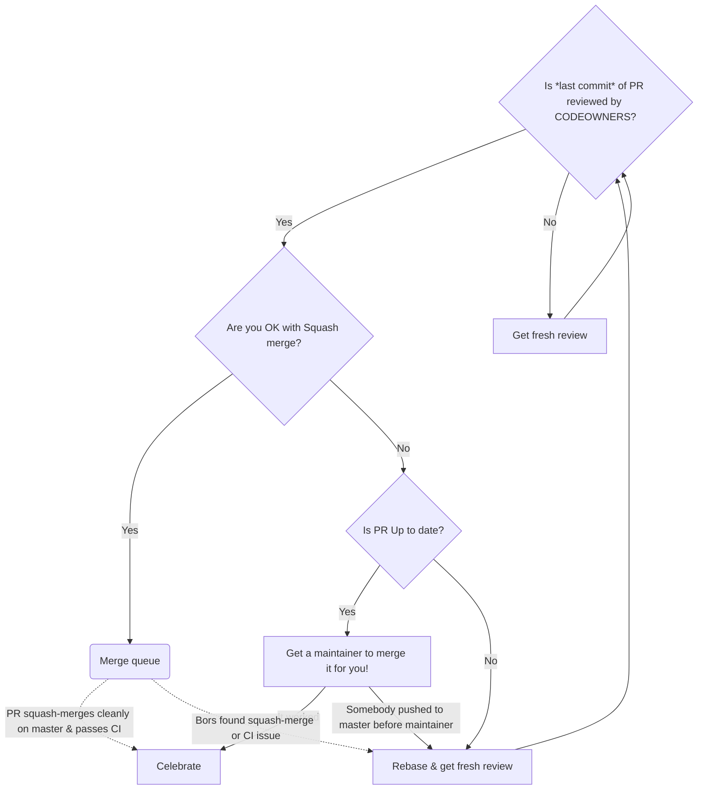

# Contributing to Lurk

We want to make contributing to this project as easy and transparent as possible.

## Pull Requests
If you want to contribute a bug fix or feature to lurk, here's how to proceed:

1. Fork the repo and create your branch from `master`.
2. If you've added code that should be tested, add tests.
3. If you've changed APIs, update the documentation.
4. Ensure the test suite passes.
5. Submit your pull-request, writing a clear description of its intended purpose, and linking any issues it addresses

## Pull Request reviews

The maintainers will review your pull request as soon as they can, and it can only be merged once it has at least one approval . The comments can be in several forms:

- 'Comment' usually indicates the reviewer doesn't yet commit to approving your code but has important remarks to contribute.
- 'Request Changes' means changes need to be made before the reviewer approves at all.
- 'Approve' can be of two forms depending on the exact nature of the comments:
    -  Approval with no restrictions, or non-blocking comments indicates this can be merged by a maintainer.
    -  Approval with explicitly marked blocking comments means: "I don't need to review this again, but I need you (and trust you) to fix these issues first."

## Merging a Pull-request

To be in a mergeable state, a pull-request must satisfy several conditions.

1. If you are OK with a squash merge, the pull-request's last commit should be approved by at least one reviewer, and all maintainers listed in the .github/CODEOWNERS file for the touched portions of the code.
2. If you would like a classic merge, the pull-request should satisfy the above conditions, and it should be a fast-forward merge (which implies it should be up to date).

**Warning:** A fast-forward merge is the merge of an up-to-date, rebased branch. This means that when it is ready to merge, your branch should not contain merge commits itself: while we have no issue with `Merge` as a merge method for a pull-request, we would like the history of a pull-request itself to be linear. One way to ensure this is to update your local branch with `git pull--rebase` (see [doc](https://www.git-scm.com/docs/git-pull)).

A maintainer will merge your pull-request (or their own) using one of two methods:
1.  GitHub's [merge queue](https://github.blog/changelog/2023-02-08-pull-request-merge-queue-public-beta/), using a squash merge strategy: this is always 'okay' and is the simplest workflow if you are okay with having a single commit.
2.  If your commit history is curated to remove junk commits and ensure each retained commit is meaningful, a repo admin can use the 'Merge' strategy.

Please feel free to add guidance to your PR summary as to which merge method you are aiming for.

The implemented workflow is as below, where the rounded corners and dotted lines are taken care of automatically by Github's merge queue:

**Note:** In exceptional cases, we may preserve some messy commit history if not doing so would lose too much important information and fully disentangling is too difficult. We expect this would rarely apply.

## Issues
We use GitHub issues to track public bugs. Please ensure your description is clear and has sufficient instructions to be able to reproduce the issue.

## License
By contributing to lurk-lang, you agree that your contributions will be licensed under both [MIT](https://opensource.org/licenses/MIT) and [Apache 2.0](http://www.apache.org/licenses/LICENSE-2.0) licenses.
