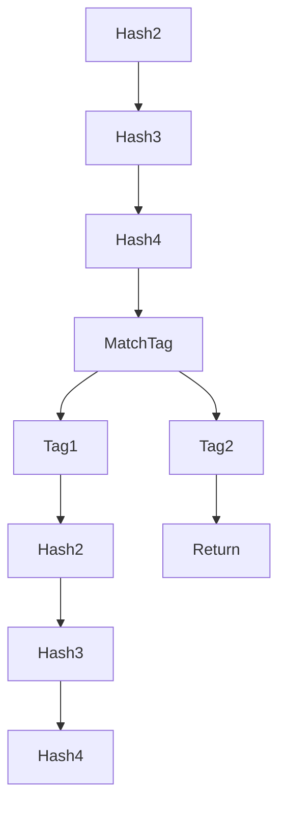

LEM stands for Lurk Evaluation Model. Its main purpose is to represent Lurk step function such that we can both interpret and synthesize the circuit. 

# Introduction

Important concepts:

    * Meta pointers. During interpretation LEM generates named pointers, which later will become allocated pointer in the circuit, using the same names. 

```mermaid
    graph MP;
        MP[Meta Pointer] --> AP[Allocated Pointer];
        HMP[HashMap<name, MetaPointer>] --> HMA[HashMap<name, AllocatedPointer>];
```

# Check

We statically check the following properties:

    * Static single assignments.
    * Non-duplicated input labels.
    * One return per LEM path.
    * Assign first, use later.
    * Ensure always return.

# Syntax

A summary of LEM syntax:

    * let
    * return
    * match_tag
    * match_symbol
    * hash, unhash

# Static Analysis

## STEP 1

    * calculate hash slots for all virtual paths.

# Interpretation

## Store

## Traversal

## STEP 2

    * calculate all preimages and images for all virtual paths.

# Synthesis

Before traversal we have we preallocate variables that were visited during interpretation, such as output variables and all preimages and images for the hash slots.

Also before traversal we constrain all hash slots.

As we traverse LEM, we push operations to a stack.

As we pop from stack, we synthesize each operation, possibly creating new allocated pointers, which are inserted in the hash map. Those variables can be accessed later, avoiding unnecessary copies inside the circuit.

We use an allocation manager component to avoid allocating constants multiples times.

Branches in LEM are constructed using `MatchTag` or `MatchSymbol`, which can be nested into each other, creating a tree of virtual paths.

We constrain only one path is followed, namely the concrete path, by enforcing a selector variable is correctly computed. A selector is a vector of Booleans representing a match between the given tag or symbol with the selected one. We show that only one Boolean, and exactly one, is true.

Later on, for any operation following a certain branch, instead of just enforcing each operation, we use an implication that can generically be stated as:

** A LEM operation in a concrete path implies this operation is enforced. **

The details of how the implication system works is presented in next section.

## Implications

## Hash slots

    * before traversal:
        ** preallocate all preimages and images
        ** synthesize slots
    * during traversal:
        ** use preallocated pointers in `Return` operations
        ** use preallocated pointers to construct implications in Hash and Unhash operations



In this figure at most 2 slots is enough for every path, but on path given by `Tag2`, we need to **complete with dummies**. 
