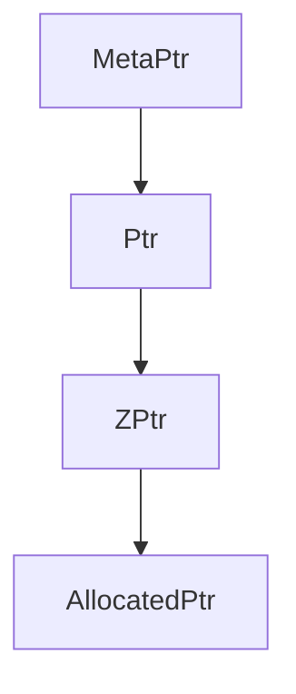
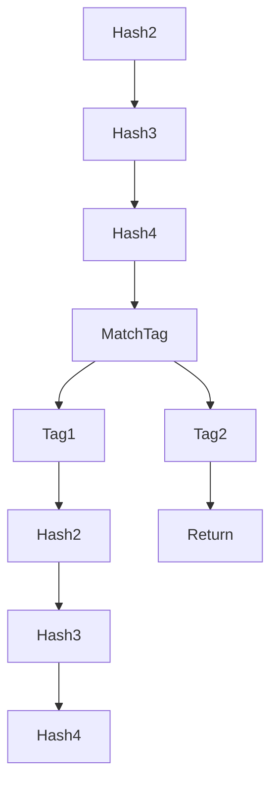

## Lurk Evaluation Model (LEM)

The main purpose of LEM is to represent Lurk's step function *as data*, which can
be interpreted or used to synthesize the circuit.

### Pointer cycle

The variables of a LEM are represented by *meta pointers*, which become bound to
concrete pointers during interpretation. So a `MetaPtr` is a named reference to
a `Ptr`.

To synthesize the circuit, the `Ptr`s that come from interpretation are hashed
and become `ZPtr`s, whose data can be allocated in the circuit to generate
*allocated pointers* (`AllocatedPtr`).

### Check

We statically check the following properties:

* Static single assignments
* Non-duplicated input labels
* One return per LEM path
* Assign first, use later
* Ensure always return

### LEM macro syntax

A summary of LEM syntax:

* `let`
* `return`
* `match_tag`
* `match_symbol`
* `hash`, `unhash`
* `hide`, `open`

# Static Analysis

The first traversal of LEM is the static analysis phase, where we allocate hash slots already considering deduplication. 

## STEP 1

    * calculate hash slots for all virtual paths.

# Interpretation

The second traversal occurs during interpretation of LEM. Given as input an expression, an environment and a continuation, the concrete path is followed by the interpreter, computing the output. 

## STEP 2

    * calculate all preimages and images for all virtual paths.

# Synthesis

Before traversal we preallocate variables that were visited during interpretation, such as output variables and all preimages and images for the hash slots. Also before traversal we constrain all hash slots.

As we traverse LEM, we push operations to a stack. As we pop from stack, we synthesize each operation, possibly creating new allocated pointers, which are inserted in the hash map of allocations. Those variables can be accessed later, avoiding unnecessary copies inside the circuit. We use an allocation manager component to avoid allocating constants multiples times.

Branches in LEM are constructed using `MatchTag` or `MatchSymbol`, which can be nested into each other, creating a tree of virtual paths. We constrain only one path is followed, namely the concrete path, by enforcing a selector variable is correctly computed. A selector is a vector of Booleans representing a match between the given tag or symbol with the selected one. We show that only one Boolean, and exactly one, is true. Later on, for any operation following a certain branch, instead of just enforcing each operation, we use an implication that can generically be stated as:

** A LEM operation in a concrete path implies this operation is enforced. **

## Hash slots

Next we summarize the synthesis process:

* before traversal:
    * preallocate all preimages and images
    * synthesize slots
* during traversal:
    * use preallocated pointers in `Return` operations
    * use preallocated pointers to construct implications in Hash and Unhash operations

In this figure at most 2 slots is enough for every path, but on path given by `Tag2`, we need to **complete with dummies**. 
